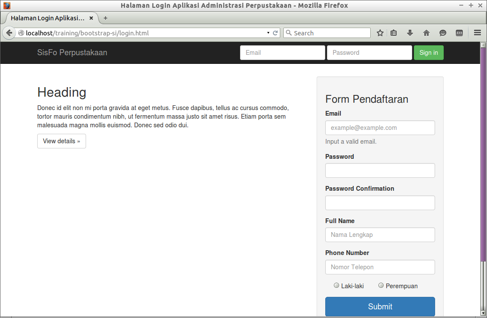
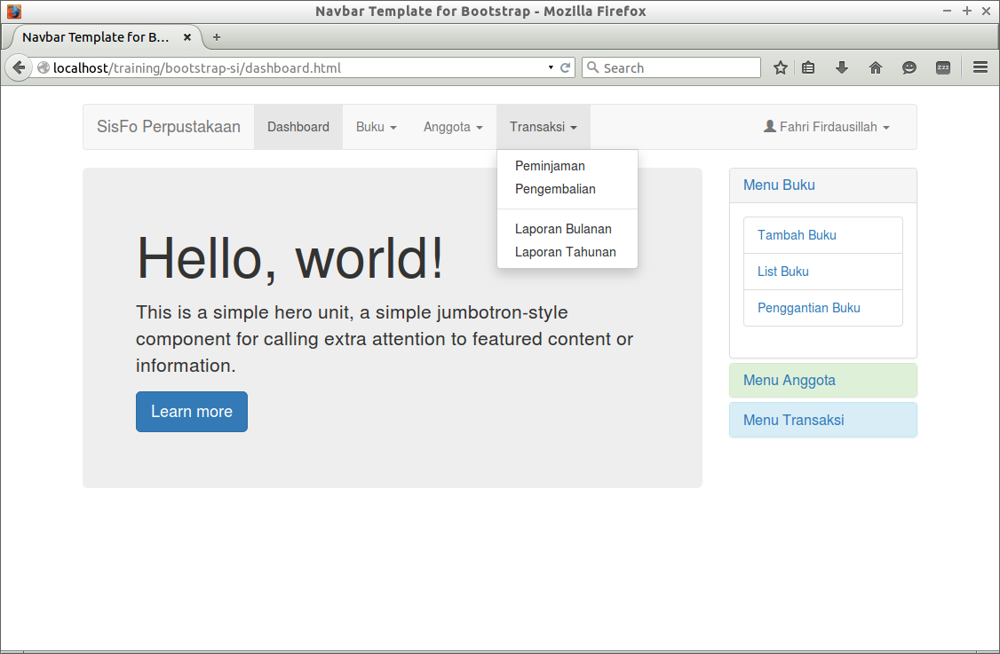
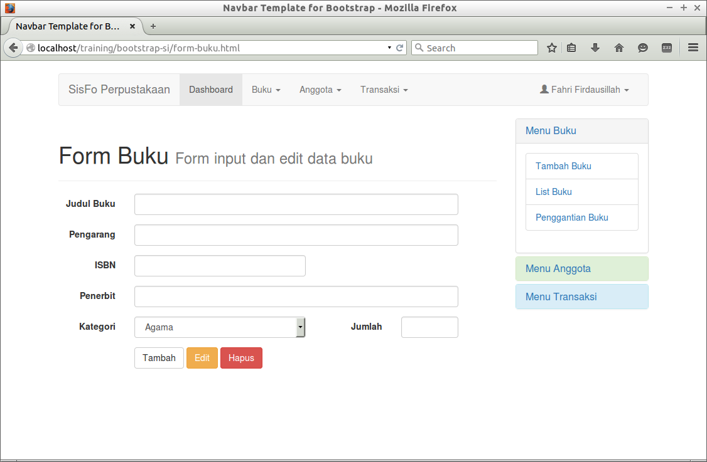
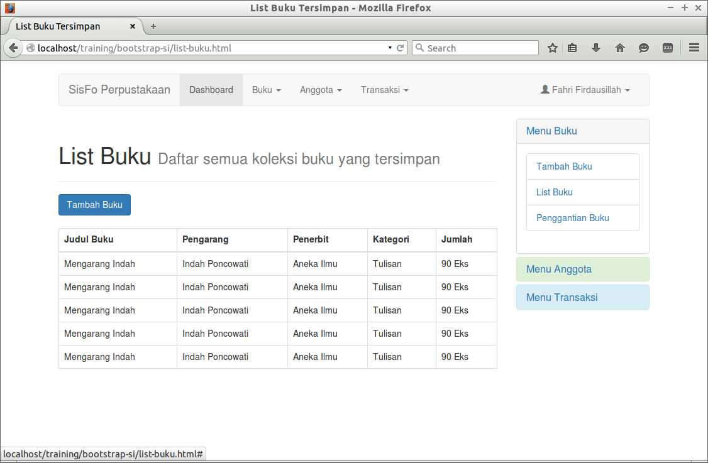
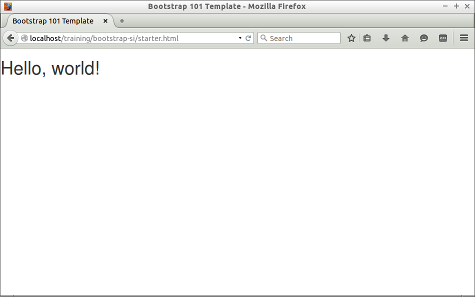

## BOOTSTRAP
## Tutorial Dasar Untuk Pemula
### Sistem Informasi *UDINUS*

Presented by: Fahri Firdausillah

http://fahrifirdaus.web.id

---

### Perkenalan Pemateri

- **Nama Lengkap:** Fahri Firdausillah
- **Alamat:** Jl. Dewi Sartika, Semarang
- **Pendidikan:**
	- Madrasah Qudsiyyah (MI, MTS, MA)
	- TI-S1 UDINUS (lulus tahun 2009)
	- Database Technology UTeM (lulus tahun 2012)
- **Riwayat Pekerjaan:** 
	- Programmer di PSI UDINUS (2009 - 2010)
	- Dosen Pemrograman di UDINUS (2012 - sekarang)
	- Freelance Programmer (2007 - sekarang)
    
---

### Perkenalan Bootstrap Sekilas

- Bootstrap adalah salah satu CSS Framework yang paling banyak digunakan saat ini
- Bootstrap memiliki kelebihan penggunaannya yang simple, dan berorientasi pada mobile first
- Sehingga halaman HTML yang didesain dengan menggunakan Bootstrap saat dibuka pada perangkat mobile akan tetap bagus dan mudah untuk dibaca
- Bootstrap awalnya digunakan oleh twitter untuk mendesain halaman web-nya, namun saat ini sudah di-open source-kan untuk dapat digunakan dan dimodifikasi oleh siapa saja.

--

### Bootstrap vs Conventional CSS

- Bootstrap memudahkan kita untuk mengatur layout tanpa harus pusing memikirkan boxing dan positioning
- Pengaturan layout di bootstrap hanya memerlukan penambahan class spesifik
- Bootstrap juga menyediakan beberapa komponen tampilan yang siap pakai
- Termasuk juga icon dan beberapa elemen animasi berbasis javascript
- Meski demikian, untuk membuat layout kita berbeda dari pengguna bootstrap lain, kita masih memerlukan editing style dengan menggunakan CSS

---

## Web yang akan kita buat

--

### Halaman Login



--

### Halaman Dashboard



--

### Halaman Form Buku



--

### Halaman List Buku



---

### Template Halaman Dengan Boostrap

- ```starter.html``` adalah template kita disini untuk menggunakan bootstrap
- Kode untuk memasukkan style bootstrap ke dalam halaman kita adalah

```
<link href="bootstrap/css/bootstrap.min.css" rel="stylesheet">
```

- Sedangkan untuk memperkaya fitur, kita juga memasukkan kode javascript

```
[script src="https://ajax.googleapis.com/ajax/libs/jquery/1.11.2/jquery.min.js"][/script]
[script src="bootstrap/js/bootstrap.min.js"][/script]
```

--



---

## Membuat Halaman Login HTML 

--

### Kerangka Navbar

- Copy ```starter.php``` menjadi file baru dengan nama ```login.php```
- Ganti isi Title menjadi ```Login Aplikasi Perpustakaan```
- Hapus ```<h1>Hello World!</h1>``` dan ganti sesuai instruksi selanjutnya
- Karena kita ingin menggunakan navbar untuk bagian atas, copy-kan  template navbar yang ada pada navbar.txt
- Untuk merubah warna menjadi hitam, ubah class ```navbar-default``` menjadi ```navbar-inverse```
- Kemudian untuk membuat navbar selalu di atas, tambahkan class ```navbar-fixed-top```

--

### Header Aplikasi dan Form Login

- Di dalam ```div container```, tambahkan kode yang ada pada navbar-header.txt untuk membuat header aplikasi
- Ganti teks di dalam ```a navbar-brand``` menjadi "SisFo Perpustakaan"
- Tambahkan juga kode pada navbar-login-form.txt persis di bawah ```div navbar-header```
- Untuk membuat form berjajar dari kiri ke kanan secara rapi, tambahkan class ```navbar-form navbar-right``` pada ```form```
- Terakhir untuk merubah warna tombol login, ubah class ```button``` dari ```btn-default``` menjadi ```btn-success```

--

### Bagi Konten Menjadi 2 Kolom

- Salah satu kelebihan Bootstrap adalam mampu memisahkan lebar halaman menjadi 12 kolom yang dapat dikonfigurasi dengan mudah melalui class
- Sekarang kita akan membagi konten halaman admin menjadi 2, 8 kolom untuk deskripsi aplikasi dan 4 kolom untuk form registrasi
- Copy-kan kode pada login-content.txt tepat di bawah elemen ```nav```
- Untuk melihat bagaimana hasilnya pemisahan ini, copykan sebagian text pada lorem-ipsum.txt ke dalam kedua ```div``` baik yang 8 kolom maupun yang 4 kolom

--

### Tambahkan Sedikit Style

- Meskipun Bootstrap sudah powerfull, tetap saja ada beberapa bagian yang perlu kita modifikasi secara langsung.
- Contohnya adalah kontent kita yang masih tumpang tindih dengan navbar.
- Untuk mengatasinya tambahkan kode berikut di bawah elemen ```link``` deklarasi bootstrap

```
<style type="text/css">
    body {
      padding-top: 50px;
      padding-bottom: 20px;
    }
    #content {margin-top: 30px;}
</style>
```

--

### Carousel &amp; Form

- Sekarang kita mengganti deskripsi abal-abal dengan tampilan gambar &amp; deskripsi dengan animasi Carousel.
- Tinggal hapus saja deskripsi abal-abal kita dengan kode yang ada pada login-carousel.txt
- Hapus juga isi teks yang ada pada ```div``` 4 kolom dengan kode pada register-panel.txt
- Selanjutnya tambahkan kode yang ada pada register-form.txt menggantikan teks "Tempat form nanti"
- Untuk mempercantik tampilan, tambahkan class ```form-control``` pada semua elemen ```input```

--

### Kurang Dikit

- Tampilannya sudah oke
- Tapi kalau kita buka di perangkat mobile, ada yang aneh
- Saat ini biarkan saja, nanti kalau ada waktu kita revisi

---

## Membuat Template Admin

--

### Navbar yang Berbeda

- Sekali lagi copy ```starter.php``` menjadi file baru dengan nama ```admin.php```
- Sama seperti sebelumnya, silahkan ubah title dan menambahkan kode pada navbar.txt dan navbar-header.txt
- Jangan lupa untuk mengubah Teks Brand menjadi "SisFo Perpustakaan"
- Kali ini kita ingin navbar lebarnya tidak full, sehingga perlu ditambahkan ```div container``` di luar navbar yang sudah dibuat
- Kemudian untuk membuat navbar agak turun, tambahkan juga style yang ada pada style-admin.txt di bawah elemen link pemanggil css bootstrap

--

### Menu Navbar

- Tambahkan kode pada menu-navbar.txt tepat di bawah elemen ```div navbar-header```  (masih di dalam elemen ```nav```)
- Untuk membuat menu tersebut berjajar secara horizontal + style, berikan tambahan class ```nav navbar-nav``` pada ```ul``` pertama saja
- Sedangkan untuk membuat sub menu menjadi drop down menu, tambahkan class ```dropdown-menu``` pada semua ```ul``` yang menjadi sub menu dari ```li .dropdown```

--

### Menu Navbar Profile

- Dengan cara yang hampir sama dengan menu navbar sebelumnya
- Tambahkan kode pada menu-profile-navbar.txt tepat di bawah  ```ul``` menu yang telah dibuat sebelumnya
- Tambahkan class ```nav navbar-nav``` pada ```ul``` pertama dan ```dropdown-menu``` pada ```ul``` yang menjadi sub menu dari ```li .dropdown```
- Agar alignment dari menu profile dari kanan ke kiri, tambahkan class ```navbar-right``` pada ```ul``` pertama


--

### Tambahkan Glyphicon

- Glyphicons merupakan icon standard yang sudah include di dalam bootstrap
- Cara penggunaannya adalah dengan menambakan elemen ```span``` sebagai berikut:

```
<span class="glyphicon glyphicon-user" aria-hidden="true"></span>
```

- Mari menambahkan ```glyphicon-user``` di sebelum nama pengguna dan ```glyphicon-log-out``` sebelum kata "logout"

--

### Adaptasi Menu Pada Mobile

- Sepintas menu sudah oke, tapi coba lihat pada layar ukuran kecil (loh kok menunya hilang semua?)
- Agar menu navigasi dapat beradaptasi dengan baik di mobile, tambahkan class ```navbar-collapse collapse``` pada ```div#navbar```
- Kemudian untuk trigger penampilnya kita memerlukan tombol yang hanya muncul pada tampilan mobile
- Tambahkan kode pada toggle-navigation.txt tepat sebelum elemen ```a.navbar-brand``` (masih di dalam elemen ```div.navbar-header```)

--- 

## Menu Pinggir Template Admin

--

### Persiapan (Membagi Konten Menjadi 2 Bagian)

- Template ini nantinya akan digunakan untuk semua aktivitas bagian admin
- sebab itulah pada bagian konten kita perlu melakukan pembagian terlebih dahulu
- Bagian 1 sebelah kiri dengan lebar 9 kolom untuk konten utama
- Bagian 2 sebelah kanan dengan lebar 3 kolom untuk menu pinggir
- Untuk melakukannya, copy-kan saja kode yang ada pada admin-content.txt tepat di bawah ```nav.navbar```

--

### Membuat Panel Pinggir

- Copy-kan kode yang ada pada side-panel.txt di dalam kolom kanan
- Tambahkan class ```panel panel-default``` pada div teratas panel tersebut dan tambahkan class ```panel-heading``` pada div di bawahnya.
- Ganti judul panel dengan "Menu Buku" dan ganti konten menu dengan kode yang terdapat pada side-menu-buku.txt
- Untuk mempercantik tampilan list menu, tambahkan class ```list-group``` pada ```ul``` dan ```list-group-item``` pada ```li```
- Copy paste panel tersebut untuk membuat panel Menu Anggota dan Menu Transaksi

--

### Cukup sekian dulu untuk panel pinggir, jika ada waktu kita akan mengubahnya menjadi collapsible panel

---

### Kerapian Sebagian Dari
## Pekerjaan Programmer

--

### Merapikan admin-template dengan PHP

- Navbar dan Side Panel akan selalu digunakan pada semua halaman admin
- Agar tidak menyusahkan kita pada saat copy paste dan membuat main konten, kita dapat memisahkan kedua elemen tersebut ke dalam berbeda dan menggunakan PHP untuk melakukan inklusi

--

### Memisahkan Navbar &amp; Panel

- Buat file admin-navbar.php dan admin-panel.php
- Cut-Paste kode navbar pada file admin-navbar.php
- dan Cut-Paste kode panel pada file admin-panel.php
- Di tempat navbar, masukkan kode PHP

```
<?php include("admin-navbar.php"); ?>
```

- Juga di tempat panel, masukkan kode PHP

```
<?php include("admin-panel.php"); ?>
```

---

## Membuat Halaman Dashboard

--

### JumboTron untuk Dashboard

- Copy file admin-template.php dengan nama dashboard.php
- Isikan ```div``` untuk main content dengan kode pada jumbotron.txt
- Tambahkan class ```jumbotron``` pada elemen ```div```

---

## Membuat Form Input &amp; Edit

--

### Membuat Form

- Copy file form-buku.txt ke dalam elemen ```div.blog_main```
- Untuk mempercantik elemen inputan, tambahkan class ```form-control``` pada semua elemen input
- Untuk membuat tampilan form horizontal, maka kita perlu membagi tampilan elemen form-group menjadi dua, yaitu untuk label dan untuk input
- Untuk label cukup 2 kolom sedangkan untuk elemen input diberikan 9 kolom.
- Tambahkan class ```col-sm-2``` pada elemen ```label``` dan ```col-sm-9``` pada ```div``` bagian input

--

### Kolom Kecil

- Khusus untuk input ISBN  &amp; Kategori, kita cukup alokasikan 5 kolom saja
- Sedangkan input jumlah lebih kecil lagi, cukup dialokasikan 2 kolom saja
- Perhatikan, pada koding input kategori  &amp; jumlah saat elemennya diperkecil mereka bisa muat dalam 1 baris
- Hal tersebut karena kedua elemen tersebut ada dalam ```div.form_group``` yang sama

--

### Mengatur Tampilan Tombol

- Untuk menyesuaikan tampilan tombol dengan tema kita, tambahkan class ```btn btn-default``` pada semua elemen ```button```
- Jika ingin warna lain, dapat juga menggunakan ```btn-primary```, ```btn-warning```, ```btn-danger```
- Selanjutnya akan lebih baik jika kita mensejajarkan posisi tombol dengan bagian input bukan bagian label
- Carannya dapat menambahkan ```col-sm-offset-2 col-sm-10``` pada ```div``` untuk tombol tersebut

---

## Membuat Tampilan List Buku

--

