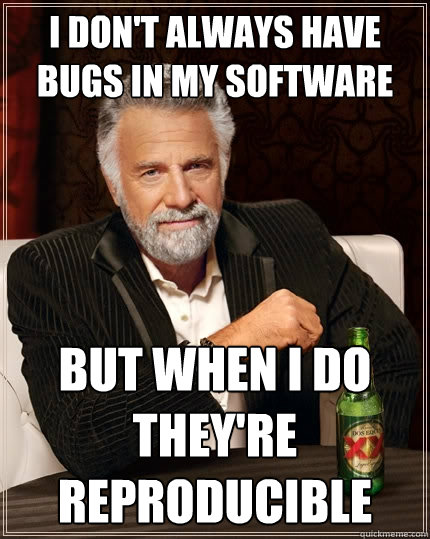
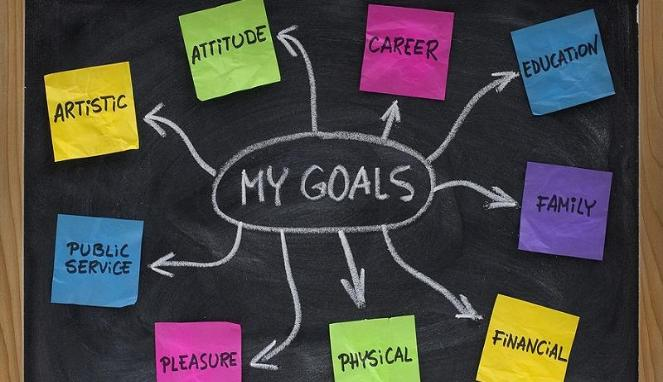
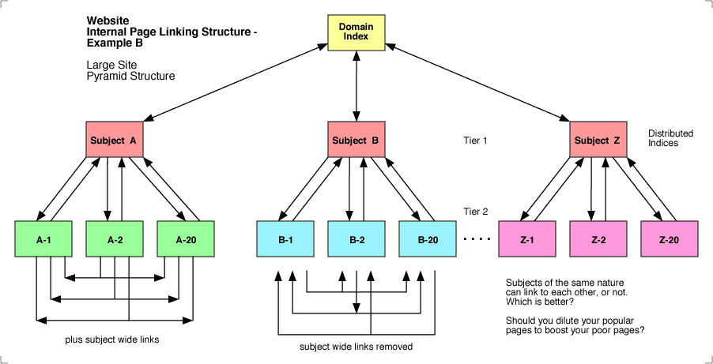
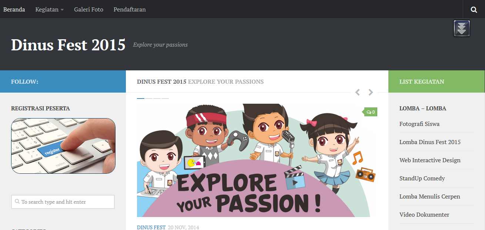
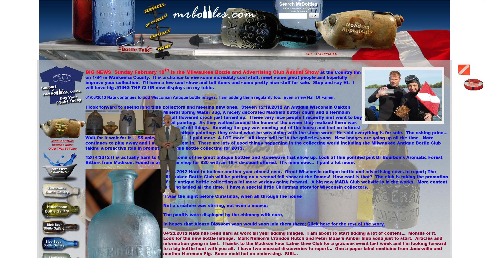
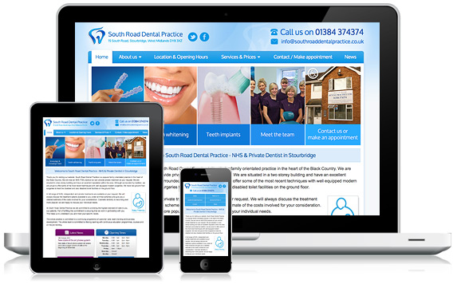
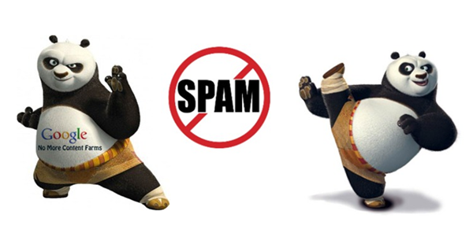

### Perkenalan Pemateri

- **Nama Lengkap:** Fahri Firdausillah
- **Alamat:** Jl. Dewi Sartika, Semarang
- **Pendidikan:**
	- Madrasah Qudsiyyah (MI, MTS, MA)
	- TI-S1 UDINUS (lulus tahun 2009)
	- Database Technology UTeM (lulus tahun 2012)
- **Riwayat Pekerjaan:** 
	- Programmer di PSI UDINUS (2009 - 2010)
	- Dosen Pemrograman di UDINUS (2012 - sekarang)
	- Freelance Programmer (2007 - sekarang)

---

---

---

### Kenapa "Pelihara" Website?

- Establish A Presence
	- Calon mahasiswa di Tegal ingin tahu apa itu Fakultas Tarbiyyah & Tadris
	- Alumni di Jakarta ingin mempromosikan almamaternya
- More Advertising for Less Money
	- Berapa biaya untuk pasang iklan di koran?
	- Berapa biaya untuk mencantumkan news features di media?
	- Berapa biaya untuk mencantumkan link di Facebook ads?

--
### Kenapa "Pelihara" Website? (2)

- Bolster Your Current Ad Campaign
	- Berapa banyak info yang bisa ditampilkan di pamflet?
	- Berapa banyak info yang bisa ditampilkan di baliho?
- Save Time with Answers to Frequently Asked Questions
- Establish a Relationship with your Clients
	- Kebanyakan orang akan memilih produk yang dikenal
	- Orang yang kritis memerlukan banyak info

--
### Kenapa "Pelihara" Website? (3)

- Gather Contact Information
	- Yang paling dibutuhkan orang marketing adalah: kontak
- 24/7 Office With No Additional Cost 
	- Sampai sekarang Internet belum mempunyai jadwal tutup
	- Di tengah malah setelah tahajjud tiba-tiba dapat ilham
	  untuk masuk UIN Walisongo

---

### Arti Website untuk Universitas
<!-- .slide: class="white-list" -->

- Publikasi resmi dari universitas
- Menyediakan informasi pada komunitas kampus
- Meneruskan misi, brand, dan pesan universitas ke konstituen

--
### Tentukan Tujuan Dari Awal
<!-- .slide: class="white-list" -->

- Apa tujuan anda?
- Apa tujuan pimpinan anda?
- Apa tujuan (calon / alumni) mahasiswa?

--
## jika tujuannya terlalu banyak? 

### Mungkin kita perlu sub-website tambahan <!-- .element: class="fragment" data-fragment-index="2" -->

---

### Agar Website "Disegani"

- Strong and clear message
	- Ingin memberi kesan pendidikan terjangkau tapi sudah itung-itungan di awal?
	- Ingin memberi kesan kaya link kerjasama tapi hanya menampilkan kurikulum?
- Outstanding Design
	- Desain yang bagus membuat web mudah diingat
	- Desain yang bagus tidak membuat kepala pusing
	- Desain yang bagus tidak mencampur comic sans dengan cambria

--
### Agar Website "Disegani" (2)
#### A picture is worth a thousand words

--
### Agar Website "Disegani" (3)

- Load time
	- Sebuah web yang memerlukan lebih dari 10 detik untuk load
	  akan kehilangan setengah jumlah pengunjung
	- Batasi pemakaian gambar dan asesoris yang tidak perlu
	- Jangan load semua konten di halaman depan
- Content and more content
- Search Engine Optimized
- Community

---

### Prinsip Desain Web (1)
#### Organization and Structure

--
### Prinsip Desain Web (2)
#### Simple Navigation

--
### Prinsip Desain Web (3)
#### Easy to read

--
### Prinsip Desain Web (4)
#### Mobile friendly

---

### Panduan Web Universitas (1)
<!-- .slide: class="white-list" -->

- Clearly identify your university on every page
- Use images that reflect your university’s values and priorities
- Make your About Us page count
- Highlight your strengths and achievements
- Make it easy for users to view a list of majors and programs

<small>http://www.nngroup.com/articles/university-sites/
by Katie Sherwin on January 19, 2014 </small>

--
### Panduan Web Universitas (2)
<!-- .slide: class="white-list" -->

- Provide information about job placement after graduation, 
  and link to it from the alumni section of the website
- Beware the perils of “making your website cool”
- Be prepared for users to search for information about 
  your university on external sites

<small>http://www.nngroup.com/articles/university-sites/
by Katie Sherwin on January 19, 2014 </small>

---

## Yang Tak Kalah Penting Dari Desain

---

### Konten Konten Konten
<!-- .slide: class="white-list" -->

- Pengunjung mencari informasi
- 93.4765% pengunjung bukan pembaca yang rajin
- Pencarian google 90% mencari teks
- Accurately describe the page's content
- Create unique title tags for each page
- Use brief, but descriptive titles

---

### Bersosialisasi Secara Sosial (1)

- Optimize your social media profiles
	- Sedikit lebih rajin melengkapi profil sosial media 
	  cukup menguntungkan
- Build links by making your content shareable
	- Usahakan pengunjung dapat melakukan sharing dengan sekali klik
	- Counter sharing ide yang bagus juga

--

### Bersosialisasi Secara Sosial (2)

- Uploading images to your social channels with descriptive name
	- Kembali ke aturan 90% pencarian google berdasarkan teks
- Duplicating another website’s content
	- Keuntungan duplikasi adalah, pengunjung bisa mendapatkan konten
	  lengkap di mana saja
	- Pencarian google akan menghasilkan beberapa item berbeda dengan
	  konten kurang lebih sama
	- INGAT!!! Duplikasi bukan spamming, atau 

--
### Google Panda akan Beraksi

